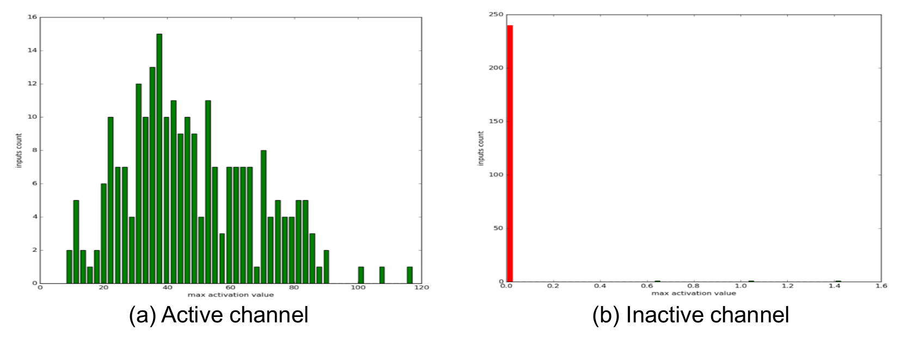
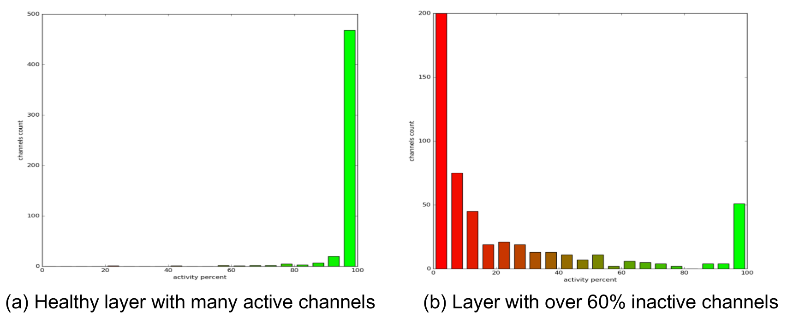

# Deep Visualization Toolbox

This repository contains an improved version of the tool, made by Arik Poznanski.
The most notable improvements are:
  * Added new visualizations: 
    * Activation Histograms
    * Activation Correlation
  * Tool usage made easier
    * Reduced number of user-tuned parameters
    * Support for non-sequential networks like: Inception and ResNet
    * Support for Siamese networks
    * Enhanced UI (Input overlays, color maps, mouse support)
    * Support input source (Directory, image list, siamese image list)
  * Tested on all major network architectures, including: LeNet, AlexNet, ZFNet, GoogLeNet, VGGNet and ResNet.  

The original version of the tool was first described [here](http://yosinski.com/deepvis) and more formally in this paper:

 * Jason Yosinski, Jeff Clune, Anh Nguyen, Thomas Fuchs, and Hod Lipson. [Understanding neural networks through deep visualization](http://arxiv.org/abs/1506.06579). Presented at the Deep Learning Workshop, International Conference on Machine Learning (ICML), 2015.

If you find this paper or code useful, we encourage you to cite the paper. BibTeX:

    @inproceedings{yosinski-2015-ICML-DL-understanding-neural-networks,
    Author = {Jason Yosinski and Jeff Clune and Anh Nguyen and Thomas Fuchs and Hod Lipson},
    Booktitle = {Deep Learning Workshop, International Conference on Machine Learning (ICML)},
    Title = {Understanding Neural Networks Through Deep Visualization},
    Year = {2015}}
    
    
## Installation 

Following are installation instruction for the new improved version of Deepvis.

    $ git clone --recursive https://github.com/arikpoz/deep-visualization-toolbox.git
    $ cd deep-visualization-toolbox && ./build_default.sh
    
Note: there is no need to download Caffe separately, it is now a sub-module of this repository and will get downloaded and built using the above instructions.

Run the tool:

    $ ./run_toolbox.py

Once the toolbox is running, push 'h' to show a help screen.   
   
## Loading a New Model

1. Define a model settings file: settings_your_model.py
```python
# network definition
caffevis_deploy_prototxt = '../your-model-deploy.prototxt'
caffevis_network_weights = '../your-model-weights.caffemodel'
caffevis_data_mean = '../your-model-mean.npy'

# input configuration
static_files_dir = '../input_images_folder'

# output configuration
caffevis_outputs_dir = '../outputs'
layers_to_output_in_offline_scripts = ['conv1','conv2', ..., 'fc1']
```

2. Define a user settings file: settings_user.py

```python
# GPU configuration
#caffevis_mode_gpu = False
caffevis_gpu_id = 2

# select model to load
model_to_load = 'your_model'
#model_to_load = 'previous_model'
```

## Basic Layout


## Activation Histograms

* Helps to study the activity of a channel over a set of inputs.

* Given a dataset of N input images, we compute the activation of each channel over the dataset and histogram the corresponding values.

1. Detect inactive channels: 


2. Detect inactive layers: 


* The behavior seen on the right, is clearly an indication of a problem in the training process. Since most of the channels are inactive and effectively the model capacity is reduced.

* A few reasons for this behavior:
  * A constant zero ReLU activation, a.k.a. “dead” ReLU.
  * Poor network initialization.
   
## Activation Correlation

* Seek correlations between activation values of different channels in the same layer to check network capacity usage.

* On the left, there is a healthy correlation matrix, where the channels are completely uncorrelated. On the right, there is a correlation matrix with all the channels either highly or inversely correlated.


* The capacity utilization of the network is relatively low. Increase in number of parameters won't improve performance.


## Maximal Input

* For each channel we find the image patch from our dataset that has the highest activation.


## Maximal Optimized

* Using a regularized optimization process we approximate for each channel the image that empirically has the highest activation 


## Backprop Modes

* Backprop visualization is basically a regular backprop step that continues to the pixel level. It provides an easy way to study the influence of each pixel on the network decision.

* Original toolbox supports only ZF-deconv and vanilla backprop.

* Our enhanced version supports also guided backpropagation that provides better localization.

* Guided backpropagation: Gradients are propagated back trough the ReLU  activation only if the forward  activation and the gradient are positive. 


